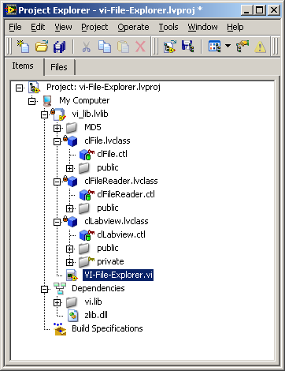
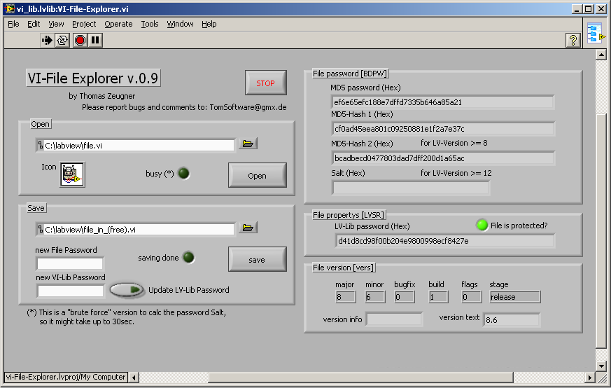

# VI-Explorer-VI

this is a lowlevel LabView-File-Format reader/writer "written" in LabView.

Features:
* open .vi file [version 4 up to 2016] and read main file structure
* decompress blocks
* calculate/overwrite file password
* read version information [vers-block]
* read password information [BDPW-block]
* save .vi file

